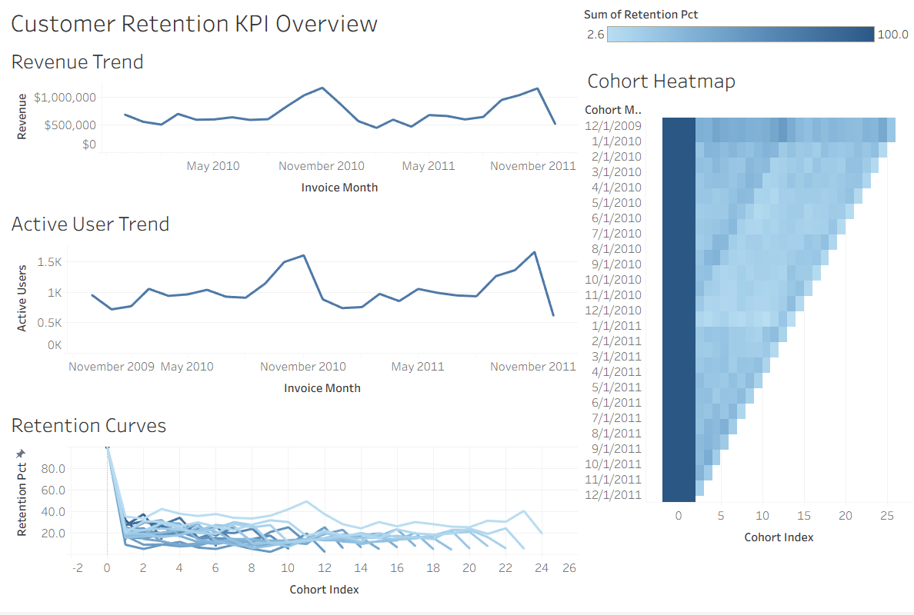

# Customer Retention & Cohort Analysis (SQL + Tableau)

## Project Overview
This project analyzes customer retention using the **[Online Retail II dataset](https://www.kaggle.com/datasets/mashlyn/online-retail-ii-uci)**.  
I built a SQL data pipeline in DuckDB to transform raw transactional data into clean analytical tables, and then created an interactive Tableau dashboard to visualize cohort retention and key business KPIs.

**Business / Learning Question:**  
How do customer cohorts behave over time, and where does churn occur?

---

## Tools & Skills
- **SQL (DuckDB):** staging, cleaning, table modeling with CTEs  
- **Python (Jupyter):** SQL execution, data sanity checks, CSV export  
- **Tableau Public:** cohort retention heatmap, retention curves, KPI trendlines, dashboard storytelling  
- **Data Storytelling:** translating analytics into business insights  

---

## Project Structure
    project-root/
    │── data/                   
    │   │── raw/                        # Original Data Set
    │   │── processed/                  # Exported Tables for Tableau
    │       │── rention_monthly.csv 
    │       │── kpit_timeseries.csv 
    │── rention-project.ipynb           # Jupyter Notebooks with SQL pipeline
    │── deliverables
    │   │── dashboard.png               # Dashboard Screenshot
    │   │── executive_summary           # Brief Summary of findings
    │── README.md                       # Project documentation (this file)
    │── requirements.txt                # Python dependencies

## Pipeline Steps
1. **Raw Staging:** load CSV → `base_table`  
2. **Cleaned Table:** clean + enrich → `real_table`  
   - dropped null customer IDs
   - calculated line revenue & month key  
3. **Retention Mart:** cohort definitions → `cohort_ret_metrics`  
   - first purchase month = cohort_month  
   - calculated retention % by cohort & months since purchase  
4. **KPI Mart:** overall active users & revenue → `kpi_timeseries`  
5. **Export:** CSVs for Tableau visualization  

---

## Tableau Dashboard
👉 [View Interactive Dashboard on Tableau Public](https://public.tableau.com/views/RetentionProject-Dashboard/CustomerRetentionKPIOverview?:language=en-US&publish=yes&:sid=&:redirect=auth&:display_count=n&:origin=viz_share_link)

**Dashboard Features:**
- **Cohort Heatmap:** rows = cohort months, columns = months since first purchase, color = retention %  
- **Retention Curves:** cohort-by-cohort retention drop-off trends  
- **KPI Trends:** active customers and revenue over time  
- **Executive Summary:** key insights on customer churn  

---

## Key Insights
- **Month 1 drop-off:** X% of customers churn after the first month  
- **By Month 3:** average retention falls below Y%  
- **Cohort comparison:** newer cohorts show [higher/lower] retention vs older cohorts  
- **Revenue trend:** overall monthly revenue peaked in [Month/Year]  

*(Replace placeholders X, Y, etc. with your real findings once you inspect the dashboard.)*

---

## Exectuive Summary
Customer retention analysis reveals that the majority of churn occurs immediately after the first purchase. 
Across cohorts from 2009–2011, retention falls from 100% at onboarding to ~30–40% by the second month, and typically below 20% by month three. 
While total active users and revenue trended upward through 2011, new cohorts did not retain better than earlier ones, suggesting growth was driven more by acquisition than loyalty. 
These findings indicate that targeted onboarding and early re-engagement strategies would likely yield the greatest impact on long-term customer value.

---
